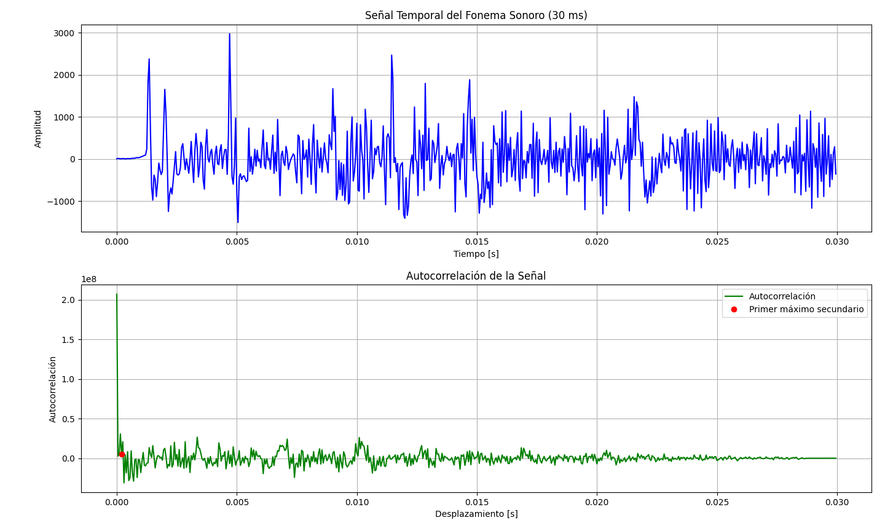

PAV - P3: estimación de pitch
=============================
Natalia Sanz y Jacobo Ghaffar
----------------------------------

Esta práctica se distribuye a través del repositorio GitHub [Práctica 3](https://github.com/albino-pav/P3).
Siga las instrucciones de la [Práctica 2](https://github.com/albino-pav/P2) para realizar un `fork` de la
misma y distribuir copias locales (*clones*) del mismo a los distintos integrantes del grupo de prácticas.

Recuerde realizar el *pull request* al repositorio original una vez completada la práctica.

Ejercicios básicos
------------------

- Complete el código de los ficheros necesarios para realizar la estimación de pitch usando el programa
  `get_pitch`.

   * Complete el cálculo de la autocorrelación e inserte a continuación el código correspondiente.


   ```
   void PitchAnalyzer::autocorrelation(const vector<float> &x, vector<float> &r) const {

    for (unsigned int l = 0; l < r.size(); ++l) {
  	  /// \TODO Compute the autocorrelation r[l]
      /// Para cada TODO que hay en el código los completemos añadir comando
      /// \HECHO hemos hecho la autocorrelación sesgada
      /// \f[
      /// r_{xx}[m]=\frac{1}{N} \sum_{n=0}^{N-m} x[n] x[n+m]
      /// \f]
      r[l] = 0.0f;
      for (unsigned int n = 0; n < x.size() - l; ++n) {
        r[l] += x[n] * x[n+l];
      }
      r[l] /= x.size();//normalización.
    }

    if (r[0] == 0.0F) //to avoid log() and divide zero 
      r[0] = 1e-10; 
  }
  ```
   * Inserte una gráfica donde, en un *subplot*, se vea con claridad la señal temporal de un segmento de
     unos 30 ms de un fonema sonoro y su periodo de pitch; y, en otro *subplot*, se vea con claridad la
	 autocorrelación de la señal y la posición del primer máximo secundario.

      Para este punto, se ha usado la señal `prueba.wav`, cortada a un trozo de interés en el que hay fonemas sonoros y que se ha nombrado `graficar.wav`.
      Se ha usado **Python** con la biblioteca `matplotlib` para obtener los siguientes resultados:
   

	 NOTA: es más que probable que tenga que usar Python, Octave/MATLAB u otro programa semejante para
	 hacerlo. Se valorará la utilización de la biblioteca matplotlib de Python.

   * Determine el mejor candidato para el periodo de pitch localizando el primer máximo secundario de la
     autocorrelación. Inserte a continuación el código correspondiente.

     Se buscará el primer máximo secundario en la gráfica de autocorrelación, esto es, excluyendo el valor de r[0]. Seguidamente, se muestra el desarrollo del código que consigue darnos tal valor:
     ```
          float PitchAnalyzer::compute_pitch(vector<float> & x) const {
          if (x.size() != frameLen)
            return -1.0F;

          //Window input frame
          for (unsigned int i=0; i<x.size(); ++i)
            x[i] *= window[i];

          vector<float> r(npitch_max);

          //Compute correlation
          autocorrelation(x, r);

          //vector<float>::const_iterator iR = r.begin(), iRMax = iR;
          unsigned int lag = npitch_min;
          float max_corr = r[npitch_min];//r[0] no ens interessa.

          for (unsigned int i = npitch_min; i < npitch_max; ++i) {
            if (r[i] > max_corr) {
              max_corr = r[i];
              lag = i;
            }
          }

          /// \TODO 
        /// Find the lag of the maximum value of the autocorrelation away from the origin.<br>
        /// Choices to set the minimum value of the lag are:
        ///    - The first negative value of the autocorrelation.
        ///    - The lag corresponding to the maximum value of the pitch.
          ///	   .
        /// In either case, the lag should not exceed that of the minimum value of the pitch.
        /// \HECHO hemos hecho la búsqueda del primer máximo secundario, excluyendo r[0]

          //unsigned int lag = iRMax - r.begin();

          float pot = 10 * log10(r[0]);
          float zcr = 0;
          for (size_t i = 1; i < x.size(); ++i) {
            if ((x[i - 1] >= 0 && x[i] < 0) || (x[i - 1] < 0 && x[i] >= 0)) {
              zcr += 1;
            }
          }
          zcr /= static_cast<float>(x.size());

          //You can print these (and other) features, look at them using wavesurfer
          //Based on that, implement a rule for unvoiced
          //change to #if 1 and compile
      #if 0
          if (r[0] > 0.0F)
            cout << pot << '\t' << r[1]/r[0] << '\t' << r[lag]/r[0] << '\t' << lag << endl;
      #endif
          
          if (unvoiced(pot, r[1]/r[0], r[lag]/r[0], zcr) || lag == 0)
            return 0;
          else
            return (float) samplingFreq/(float) lag;
        }
      ```
* Implemente la regla de decisión sonoro o sordo e inserte el código correspondiente.

  A continuación, se muestra la decisión más óptima de voiced o unvoiced:
   ```
    bool PitchAnalyzer::unvoiced(float pot, float r1norm, float rmaxnorm, float zcr) const {
      /// \TODO Implement a rule to decide whether the sound is voiced or not.
      /// * You can use the standard features (pot, r1norm, rmaxnorm),
      ///   or compute and use other ones.
      /// \HECHO criterio de decisión voiced o unvoiced
      const float pot_threshold = -40.0f;
      const float r1norm_threshold = 0.2f;
      const float rmaxnorm_threshold = 0.4f;
      const float zcr_threshold = 0.15f;

      if (pot < pot_threshold || r1norm < r1norm_threshold || rmaxnorm < rmaxnorm_threshold || zcr > zcr_threshold) {
        return true;//unvoiced
      } else {
        return false;//voiced
      }
      
    }
  ```
* Puede serle útil seguir las instrucciones contenidas en el documento adjunto `código.pdf`.

- Una vez completados los puntos anteriores, dispondrá de una primera versión del estimador de pitch. El 
  resto del trabajo consiste, básicamente, en obtener las mejores prestaciones posibles con él.

  * Utilice el programa `wavesurfer` para analizar las condiciones apropiadas para determinar si un
    segmento es sonoro o sordo. 
	
	  - Inserte una gráfica con la estimación de pitch incorporada a `wavesurfer` y, junto a ella, los 
	    principales candidatos para determinar la sonoridad de la voz: el nivel de potencia de la señal
		(r[0]), la autocorrelación normalizada de uno (r1norm = r[1] / r[0]) y el valor de la
		autocorrelación en su máximo secundario (rmaxnorm = r[lag] / r[0]).

		Puede considerar, también, la conveniencia de usar la tasa de cruces por cero.

	    Recuerde configurar los paneles de datos para que el desplazamiento de ventana sea el adecuado, que
		en esta práctica es de 15 ms.


      Como podemos ver, en la gráfica hay 4 tramos sonoros que son los tramos con puntos negros en la ventana de arriba, que es en la que se mide el pitch. Por otro lado, los tramos sordos son en los tramos en los que no hay puntos negros en la ventana del pitch. Lo que coincide con el waveform de abajo ya que los 	sonoros son los tramos donde estan los picos más grandes mientras que los sordos son más bajos y erráticos.


      - Use el estimador de pitch implementado en el programa `wavesurfer` en una señal de prueba y compare
	    su resultado con el obtenido por la mejor versión de su propio sistema.  Inserte una gráfica
		ilustrativa del resultado de ambos estimadores.
     
		Aunque puede usar el propio Wavesurfer para obtener la representación, se valorará
	 	el uso de alternativas de mayor calidad (particularmente Python).
   Mediante este codigo conseguimos ver las graficas:
   
   

  

  

  * Optimice los parámetros de su sistema de estimación de pitch e inserte una tabla con las tasas de error
    y el *score* TOTAL proporcionados por `pitch_evaluate` en la evaluación de la base de datos 
	`pitch_db/train`..

    A continuación, se muestra el resumen de la evaluación de la base de datos, sin añadir ningún argumento en la línea de comandos:

    **Summary**

    Num. frames:	11200 = 7045 unvoiced + 4155 voiced
    Unvoiced frames as voiced:	126/7045 (1.79 %)
    Voiced frames as unvoiced:	655/4155 (15.76 %)
    Gross voiced errors (+20.00 %):	46/3500 (1.31 %)
    MSE of fine errors:	2.19 %

    ===>	TOTAL:	90.02 %

    Ahora, si aplicamos el filtrado pasobajo, obtenemos el siguiente resultado (una mejora en 0.38 décimas respecto a la anterior):

    **Summary**

    Num. frames:	11200 = 7045 unvoiced + 4155 voiced
    Unvoiced frames as voiced:	229/7045 (3.25 %)
    Voiced frames as unvoiced:	501/4155 (12.06 %)
    Gross voiced errors (+20.00 %):	63/3654 (1.72 %)
    MSE of fine errors:	2.35 %

    ===>	TOTAL:	90.40 %

    Es curioso que en aplicar el filtro de mediana y la ventana de Hamming, junto al filtro pasobajo, obtenemos el mismo resultado. 

    Finalmente, el elemento que mejora el sistema principalmente es el filtrado pasobajo.


Ejercicios de ampliación
------------------------

- Usando la librería `docopt_cpp`, modifique el fichero `get_pitch.cpp` para incorporar los parámetros del
  estimador a los argumentos de la línea de comandos.
  
  Esta técnica le resultará especialmente útil para optimizar los parámetros del estimador. Recuerde que
  una parte importante de la evaluación recaerá en el resultado obtenido en la estimación de pitch en la
  base de datos.

  * Inserte un *pantallazo* en el que se vea el mensaje de ayuda del programa y un ejemplo de utilización
    con los argumentos añadidos.

    Aquí se muestra el mensaje de ayuda, tras añadir la posibilidad de escoger el tipo de ventana, activar el filtro pasobajo y el filtro de mediana por la línea de comandos:

    

    El ejemplo de utilización se ha comentado en puntos anteriores.


- Implemente las técnicas que considere oportunas para optimizar las prestaciones del sistema de estimación
  de pitch.

  Entre las posibles mejoras, puede escoger una o más de las siguientes:

  * Técnicas de preprocesado: filtrado paso bajo, diezmado, *center clipping*, etc.
  * Técnicas de postprocesado: filtro de mediana, *dynamic time warping*, etc.
  * Métodos alternativos a la autocorrelación: procesado cepstral, *average magnitude difference function*
    (AMDF), etc.
  * Optimización **demostrable** de los parámetros que gobiernan el estimador, en concreto, de los que
    gobiernan la decisión sonoro/sordo.
  * Cualquier otra técnica que se le pueda ocurrir o encuentre en la literatura.

  Encontrará más información acerca de estas técnicas en las [Transparencias del Curso](https://atenea.upc.edu/pluginfile.php/2908770/mod_resource/content/3/2b_PS%20Techniques.pdf)
  y en [Spoken Language Processing](https://discovery.upc.edu/iii/encore/record/C__Rb1233593?lang=cat).
  También encontrará más información en los anexos del enunciado de esta práctica.

  Incluya, a continuación, una explicación de las técnicas incorporadas al estimador. Se valorará la
  inclusión de gráficas, tablas, código o cualquier otra cosa que ayude a comprender el trabajo realizado.

  En este programa se ha implementado el filtro pasobajo, el filtro de mediana y la ventana de Hamming.

  En primer lugar, la implementación del filtro pasobajo:
  ```
  void lowPassFilter(std::vector<float>& signal, int window_size = 5) {
    std::vector<float> filtered_signal(signal.size(), 0.0f);

    for (size_t i = window_size; i < signal.size() - window_size; ++i) {
        float sum = 0.0f;

        for (int j = -window_size; j <= window_size; ++j) {
            sum += signal[i + j];
        }

        filtered_signal[i] = sum / (2 * window_size + 1);
    }

    signal = filtered_signal;
  }
  ```
  En segundo lugar, el filtro de mediana:
  ```
      void medianFilter(std::vector<float>& f0, int window_size = 5) {
        std::deque<float> window;
        for (size_t i = 0; i < f0.size(); ++i) {
            window.push_back(f0[i]);
            
            if (window.size() > window_size) {
                window.pop_front();
            }

            if (window.size() == window_size) {
                std::vector<float> sorted_window(window.begin(), window.end());
                std::nth_element(sorted_window.begin(), sorted_window.begin() + sorted_window.size() / 2, sorted_window.end());
                f0[i] = sorted_window[sorted_window.size() / 2];
            }
        }
    }
  ```
  Y, finalmente, la ventana de Hamming:
  ```
   case HAMMING:
      /// \TODO Implement the Hamming window
      /// \HECHO
      for (size_t n = 0; n < frameLen; ++n) {
        float window_value = 0.54f - 0.46f * std::cos(2.0f * M_PI * n / (frameLen - 1));
        window[n] = window_value;
      }
      break;
  ```
  También se valorará la realización de un estudio de los parámetros involucrados. Por ejemplo, si se opta
  por implementar el filtro de mediana, se valorará el análisis de los resultados obtenidos en función de
  la longitud del filtro.
   

Evaluación *ciega* del estimador
-------------------------------

Antes de realizar el *pull request* debe asegurarse de que su repositorio contiene los ficheros necesarios
para compilar los programas correctamente ejecutando `make release`.

Con los ejecutables construidos de esta manera, los profesores de la asignatura procederán a evaluar el
estimador con la parte de test de la base de datos (desconocida para los alumnos). Una parte importante de
la nota de la práctica recaerá en el resultado de esta evaluación.
